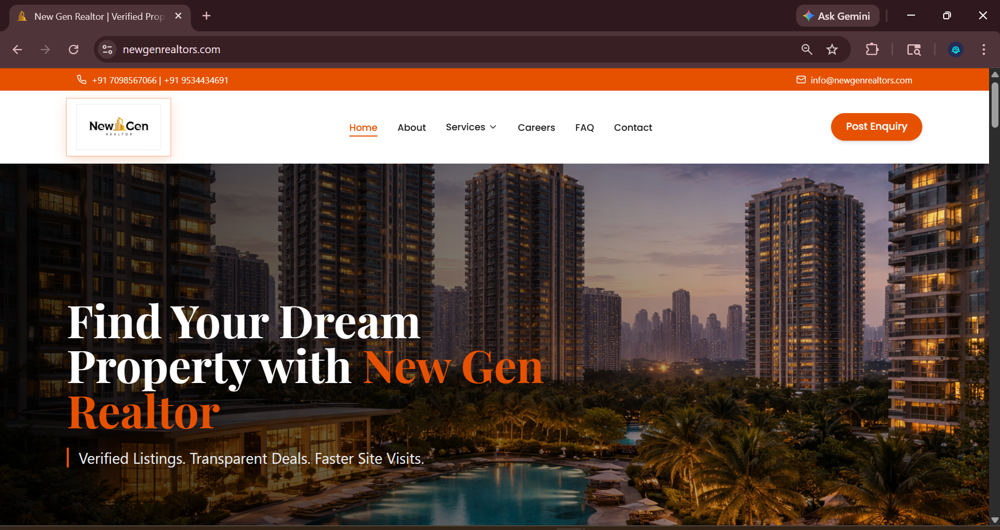
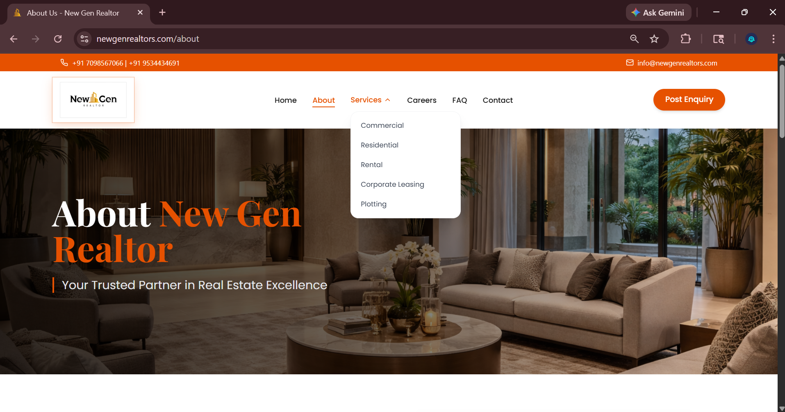

# new-gen-realtors-website-case-study
Client website case study for New Gen Realtors, a real estate business website with property service sections, inquiry flow, responsive design, and live deployment.

# New Gen Realtors Website Case Study

Client website case study for New Gen Realtors, a real estate business website with property service sections, inquiry flow, responsive design, and live deployment.

## Overview

This is a client website case study for New Gen Realtors, a real estate business website. The website was built to create a professional online presence, present real estate services, and help customers send property-related inquiries easily.

## Live Website

https://newgenrealtors.com/

## Project Type

Client Website Development

## Business Category

Real Estate / Realtor Services

## Key Features

* Professional real estate homepage design
* Property-focused hero section
* Real estate service categories
* Services dropdown menu
* Post enquiry call-to-action
* About section with business highlights
* Contact section
* Responsive website layout
* Live website deployment

## Tech Stack

* HTML
* CSS
* JavaScript
* Vite / Frontend Build Setup
* Responsive Web Design
* Live Server Deployment
* AI-assisted development support

## My Role

I worked on the website structure, page layout, content placement, responsive design, user flow, and deployment support. The website was built as a real client project and deployed live for public access.

## Screenshots

### Homepage

### Services Dropdown

### About Section

### Contact Section

## Status

Completed and live.

## Confidentiality Note

This repository is a portfolio case study. Sensitive client data, admin access, backend files, API details, form submissions, hosting credentials, and private source code are not included.
